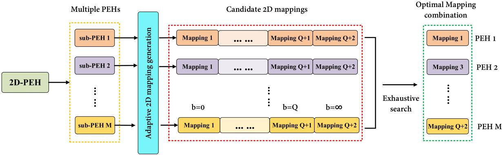
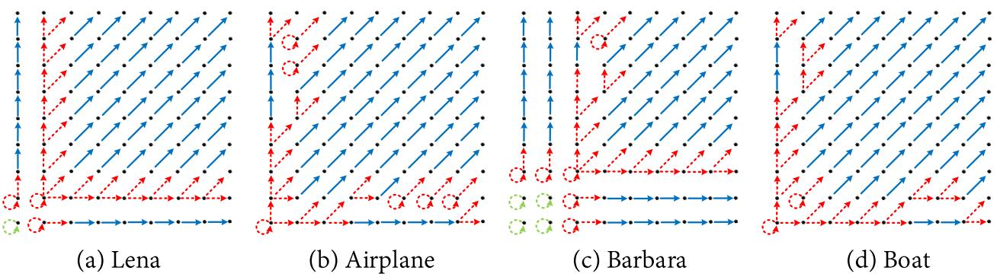
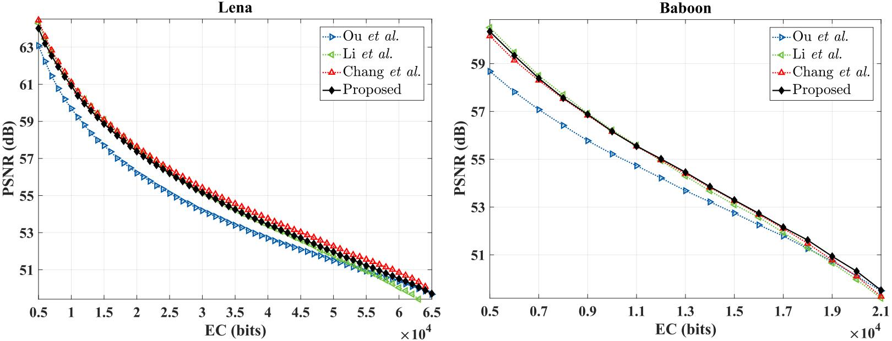
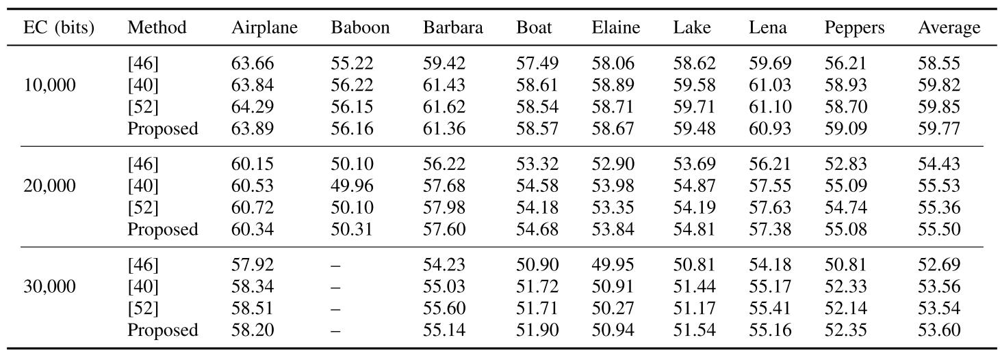
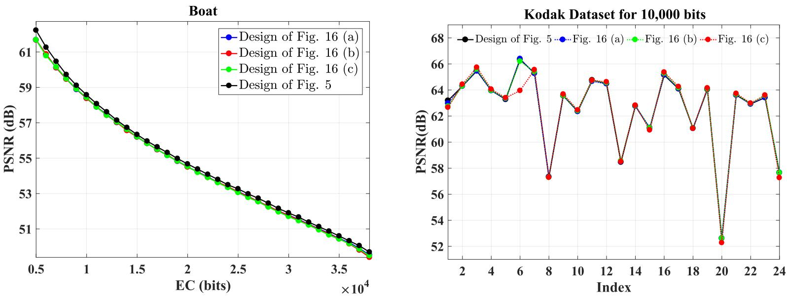

Adaptive multiple 2D histograms modification based RDH
=======


This repo is implementation for the accepted paper "[Reversible data hiding based on multiple adaptive two-dimensional prediction-error histograms modification](https://ieeexplore.ieee.org/document/9605567)" (TCSVT 2022).


<p align="center">     </p>
<p align="center"> Figure 1: Framework of the adaptive multiple 2D mappings generation for MHM. </p>


## How to run

### Basic method 

```
## cd ./Basic

run main.m 
```

### Extension methods

```
## cd ./V1_fig16(a)

run main.m
```
```
## cd ./V1_fig16(b)

run main.m
```
```
## cd ./V1_fig16(c)

run main.m
```

## Experimental Results

<p align="center">     </p>
<p align="center"> Figure 2: The adaptive 2D mappings. </p>

<p align="center">     </p>
<p align="center"> Figure 3: The PSNR resukls for Lena and Baboon. </p>

<p align="center">     </p>
<p align="center"> Figure 4: The PSNR results for fixed embedding capacity. </p>

<p align="center">     </p>
<p align="center"> Figure 5: The comparison for the basic method and the extensions. </p>


## Environment
Matlab 2016b <br>


## Acknowledgement
This work was supported by the National Science Foundation of China under Grant 61872128 and Grant 92067104.


## Citation
If you find this work useful for your research, please cite
```
@ARTICLE{9605567,
  author={Zhang, Cheng and Ou, Bo},
  journal={IEEE Transactions on Circuits and Systems for Video Technology}, 
  title={Reversible Data Hiding Based on Multiple Adaptive Two-Dimensional Prediction-Error Histograms Modification}, 
  year={2022},
  volume={32},
  number={7},
  pages={4174-4187},
  doi={10.1109/TCSVT.2021.3125711}}
```

## License and Copyright
The project is open source under MIT license (see the ``` LICENSE ``` file).

